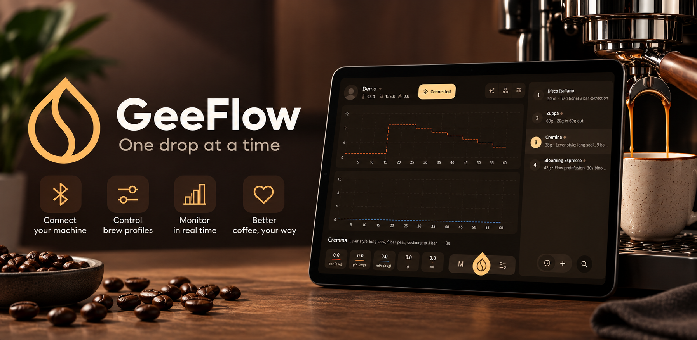

  

# GeeFlow

A Kotlin Multiplatform app for controlling and monitoring espresso machines over BLE, targeting **Android**, **iOS**, and **Desktop (JVM)**.

  
  &nbsp;&nbsp;
  

## Screenshots

### Tablet

  
  
  

### Phone

  
  
  

## Supported Hardware

Right now the only real machine supported and tested is the **Wendougee Data-S**. Other machines are not supported yet; the protocol is machine-specific and nothing else has been tried.

The **Wendougee smart grinder** is not supported yet, simply because I do not own one to reverse engineer and test against. Only the smart scale is wired up on the accessory side.

A built-in **Demo** device is also available for preview purposes. It simulates a machine entirely in software, so you can explore the whole app (dashboard, profiles, charts, history) without owning any hardware. Add it from the *Add Device* screen.

> [!WARNING]
> **This is an unofficial, third-party application.** While it utilizes the manufacturer's native communication protocol, the integration was independently reverse-engineered and is not endorsed, certified, or supported by the manufacturer.
>
> Because this application sends direct hardware commands (including heating targets, pressure profiles, and cleaning cycles), unforeseen bugs or firmware incompatibilities could cause your machine to operate incorrectly.
>
> **By using this software, you acknowledge and agree that:**
> - You use it entirely at your own risk.
> - It may cause unintended behavior, damage your machine, or void your warranty.
> - You must **never** leave the machine unattended while it is under app control.

### Error Handling Limitation

The error codes reported by the machine have **not** been mapped. The only fault the app currently recognizes and surfaces is the **low water level alarm**. Every other error condition the machine can report is unknown to the app and will pass silently. The app will not warn you, and may keep issuing commands as if nothing were wrong. If the machine behaves unexpectedly, check it with the manufacturer's own app, which can read the fault codes this app cannot.

## Features

**Brewing**
- Manual brewing with configurable time and pressure
- Profile brewing with multi-step pressure, flow, and wait stages (variable-pressure and constant-pressure modes)
- Experimental profiles with app-controlled ramps and measurement-based step transitions
- Freehand ("free variable") brewing - steer pressure or flow live from a control screen, and optionally save the result as a profile
- Finish conditions by target weight or target volume
- Stop a brew at any time

**Brew Profiles**
- Create, edit, duplicate, delete, and reorder profiles
- Visual profile editor with per-step editing and descriptions
- Profiles are per-user; a set of defaults ships with the app and can be restored
- Bind compatible profiles to the machine's paddle/button for native execution; once bound, edits are synced to the machine as you save them, and a failed sync aborts the save
- Save profiles even when they exceed the machine's native recording capacity or use features that cannot be bound to its paddle/button

**Experimental Profiles**
- GeeFlow runs these profiles by sending live targets and evaluating measurements throughout the brew, rather than uploading the complete profile for the machine to execute
- Combine pressure, flow, and wait steps, each with a required time limit
- Choose instant, linear, ease-in, ease-out, or ease-in-out transitions for pressure and flow targets, with a configurable ramp duration
- Start a ramp from the previous target or the current measurement
- Add exit conditions for total volume, total weight, pressure, and flow; pressure and flow support upper and lower thresholds
- Use OR to advance when any measurement condition is met, or AND to require all measurement conditions to be met at the same time. The time limit always ends the step independently of AND/OR
- Weight-based conditions require a connected scale
- Experimental indicators identify features that the selected machine cannot execute natively. Available features depend on the machine's capabilities
- Experimental profiles require the app to remain active and connected during brewing and cannot be assigned to the machine's paddle/button

On the Wendougee Data-S, experimental flow targets are implemented by adjusting pump pressure in response to measured pump flow. This lets a profile combine pressure and flow steps without switching the machine's active control mode. Flow regulation is performed by GeeFlow and depends on measurement updates and the pump's response. Reported pressure is pump pressure, not puck backpressure.

**Live Monitoring**
- Real-time dashboard: brew and steam boiler temperatures, pressure, flow rate, volume, weight, weight rate, and elapsed time
- Live charts for pressure, flow rate, weight rate, volume, and weight, each of which can be hidden or shown at will
- Pressure, pump flow, and weight rate share a chart, with weight rate hidden by default
- Profile charts show target ramps, numbered step boundaries, and exit-condition markers, including the conditions that triggered transitions during brewing
- Brew history with the recorded curve and the profile steps as they were at brew time

**Machine Control & Settings**
- Brew and steam boiler targets, with independent on/off per boiler
- Full-speed and pulse heating modes
- Manual brew time and pressure defaults
- Cleaning/backflush cycles with configurable duration, standby, and repeat count, plus start/stop and live cleaning status
- Water alarm toggle
- Quick settings and quick maintenance dialogs on the dashboard; long-press the quick settings button to toggle the steam boiler without opening anything

**Smart Scale**
- Scan for, connect, and disconnect a supported Bluetooth scale
- Live weight and flow-by-weight feed into the dashboard, charts, and weight-based finish conditions

**Devices**
- Pair via QR code or by scanning for nearby BLE devices
- Multiple saved devices, with a favorite and optional auto-connect
- Connection state surfaced throughout (connecting, synchronizing, connected)

**Adaptive Layout**
- Works in both portrait and landscape, on phones, tablets, and desktop windows
- Layouts adapt to the available width rather than the platform: settings screens switch to a list-detail arrangement when there is room, and the dashboard, profile editor, and pairing flow reflow to match
- Resizing a desktop window or rotating a device re-lays out live, without losing state

**Users & Personalization**
- Multiple local user profiles, each with its own photo, brew profiles, history, and settings
- Theming: light/dark/system, custom seed color, palette style
- Celsius/Fahrenheit
- Keep-screen-on, full-screen mode
- Open-source license listing

## Project Layout

* [/shared](./shared) contains all shared Kotlin Multiplatform code, split into layered modules:
  - `core/` - domain primitives, navigation contracts, presentation base classes, shared Compose UI, DataStore factory
  - `data/` - SQLDelight database plus user, device, and brew repositories
  - `domain/` - use cases for user, device, and brew flows
  - `feature/` - screen-level modules (intro, user list/settings, device list/add/dashboard/settings)
  - `permissions/` - platform permission handling
  - `app/` - Koin wiring and the shared `App` entry point consumed by each platform launcher
* [/androidApp](./androidApp) contains the Android application entry point.
* [/desktopApp](./desktopApp) contains the Desktop (JVM) application entry point and packaging config.
* [/iosApp](./iosApp) contains the iOS application entry point and any SwiftUI code.
* [/build-logic](./build-logic) contains the Gradle convention plugins (`kmp.library`, `kmp.feature`, `kmp.compose`, `kmp.koin`, `kmp.sqldelight`, `kmp.android`) that all modules apply.

Within each shared module, `commonMain` holds code common to all targets and the remaining source sets hold platform-specific code (`androidMain`, `iosMain`, `jvmMain`).

---

Learn more about [Kotlin Multiplatform](https://www.jetbrains.com/help/kotlin-multiplatform-dev/get-started.html) and
[Compose Multiplatform](https://github.com/JetBrains/compose-multiplatform/#compose-multiplatform).

## License

This project is licensed under the GNU General Public License v3.0 - see the [LICENSE](./LICENSE) file for details.
